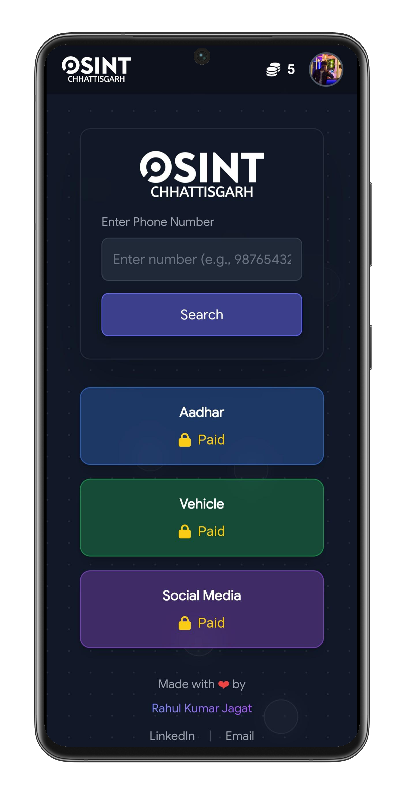

# CG OSINT 🕵️

A web-based Open Source Intelligence (OSINT) tool designed for cybersecurity purposes to find publicly available information associated with phone numbers, focusing on the Chhattisgarh (CG) region of India.

 ---

## 📝 About The Project

CG OSINT is a simple yet effective web utility built to help users gather publicly accessible data linked to a phone number. By entering a number and initiating a search, the application queries various public data sources to retrieve relevant details. This project is specifically optimized for numbers originating from the Chhattisgarh region and is intended for use in cybersecurity investigations and educational contexts.

**Disclaimer:** This tool is intended for ethical and informational purposes only. It retrieves data that is already publicly available and does not access private information. The user is solely responsible for using this tool in compliance with all applicable laws.

---

## ✨ Features

-   **Web-Based Interface:** No installation needed, just a modern web browser.
-   **Phone Number Lookup:** Enter any 10-digit number to start the search.
-   **Instant Results:** Fetches and displays information directly on the page.
-   **Region-Focused:** Optimized for numbers based in Chhattisgarh, India.
-   **Lightweight:** Built with core web technologies for fast loading and performance.

---

## 🛠️ Technology Stack

This is a pure front-end project built with fundamental web technologies:

-   **HTML5:** For the structure and content of the web page.
-   **CSS3:** For styling and creating a responsive user interface.
-   **JavaScript (JS):** For handling user input, fetching data from APIs, and displaying the results dynamically.

---

## 🚀 Getting Started

To get a local copy up and running, follow these simple steps.

### Prerequisites

-   A modern web browser (e.g., Google Chrome, Mozilla Firefox, Microsoft Edge).
-   A code editor like VS Code (optional, for making modifications).

### Installation

1.  **Clone the repository:**
    ```sh
    git clone [https://github.com/RahulKumarJagat/CG-Osint.git](https://github.com/RahulKumarJagat/CG-Osint.git)
    ```
2.  **Navigate to the directory:**
    ```sh
    cd CG-Osint
    ```
3.  **Open the application:**
    -   Simply open the `index.html` file in your favorite web browser.

---

##  Usage

1.  Open the `index.html` file in your web browser.
2.  Enter the 10-digit phone number you wish to investigate in the input field.
3.  Click the "Search" button.
4.  Wait for the application to gather and display the results on the page.

---

## 🤝 Contributing

Contributions are what make the open-source community such an amazing place to learn, inspire, and create. Any contributions you make are **greatly appreciated**.

To contribute:
1.  Fork the Project
2.  Create your Feature Branch (`git checkout -b feature/AmazingFeature`)
3.  Commit your Changes (`git commit -m 'Add some AmazingFeature'`)
4.  Push to the Branch (`git push origin feature/AmazingFeature`)
5.  Open a Pull Request

---

## 📄 License

Distributed under the MIT License. See `LICENSE` for more information.
